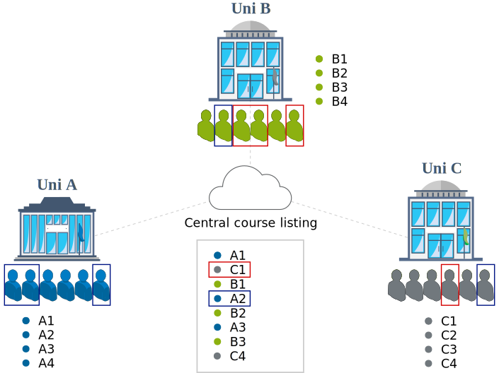

<!-- ---
sidebar: auto
--- -->

# eLearning Sharing

eLearning Sharing is the concept of sharing eLearning courses between partner universities.

## Example

In this example, there are 3 universities: Uni A, Uni B, Uni C.
Imagine each of the universities manages and hosts its own courses in a local instance of a learning management system (LMS) e.g. moodle. The courses are numbered A1…​An, B1…​Bn, C1…​Cn, respectively.
The universities would like to share some of the eLearning courses with other universities in a way that students from other universities can enroll into the shared course, participate at moderated sessions, do exercises and finally get graded by the foreign lecturer.
The **StudyATHome Internationally hub** provides a central course listing, which is used to disseminate the shared courses and to make it easier for students to search for topics of interest and respective courses.
In the example shown in the image, course A2 is hosted at university A and has 3 enrolled students from university A, 1 from University B, and 1 from University C.
Course C1 has 3 students from University C and 1 from University B.

::: full-width-image

:::

## Workflow

Students which are matriculated at any of the partner universities may enroll in one of the listed [courses](/courses/). They will have to do exams and assignments remotely and will get a grade certificate issued by the partner university upon completion of the course. Finally, the students will have to take the certificate for recognition at the home university.

<!-- ::: full-width-image

::: -->

